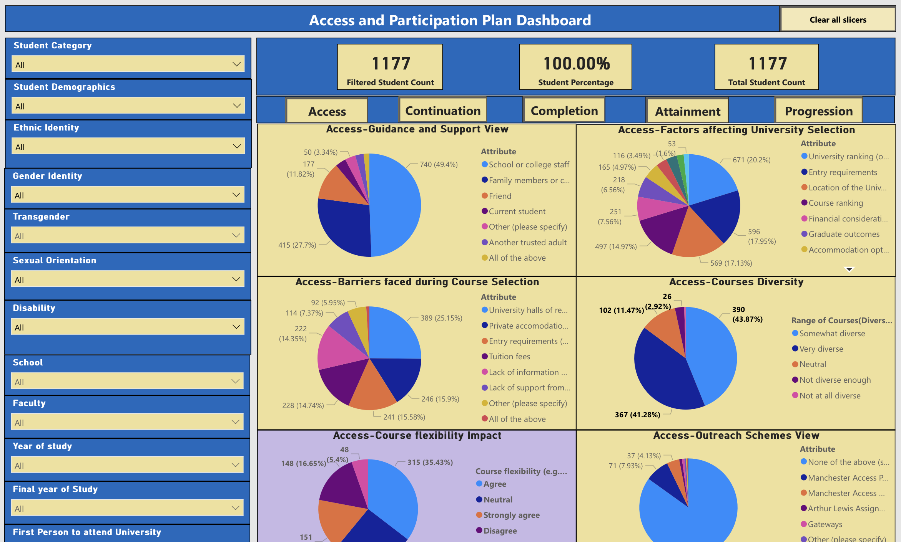
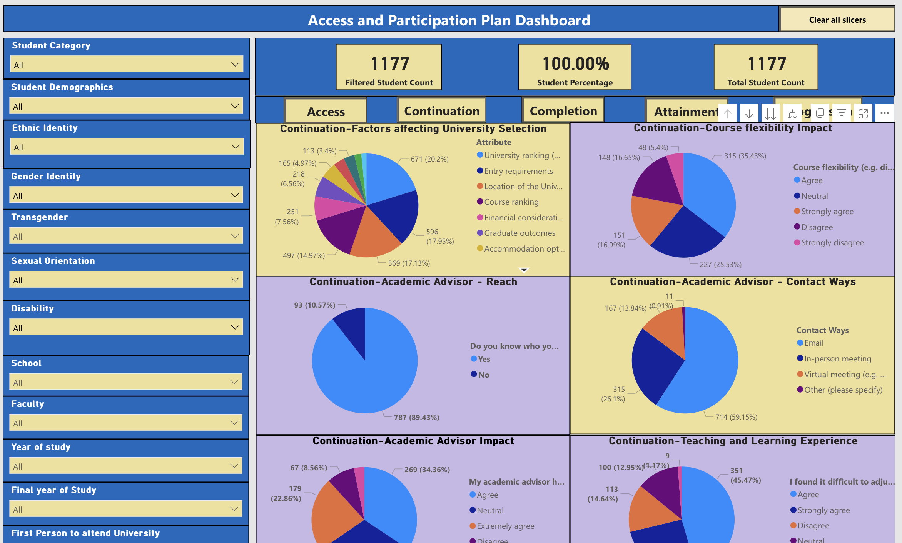
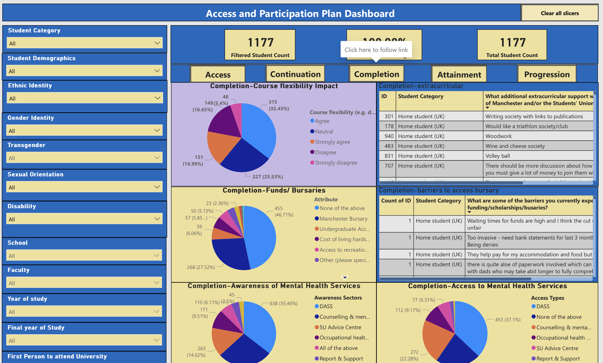
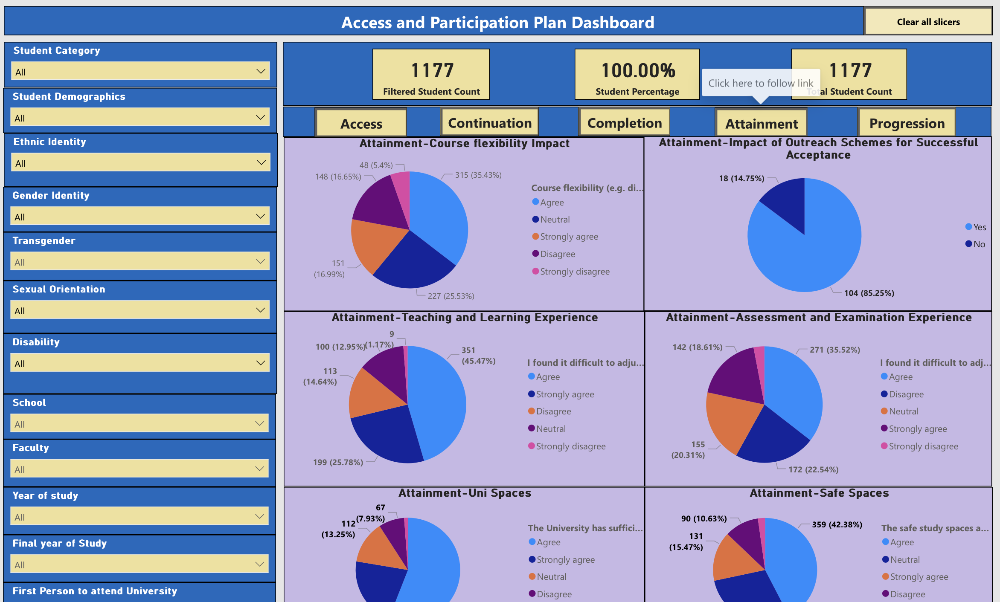
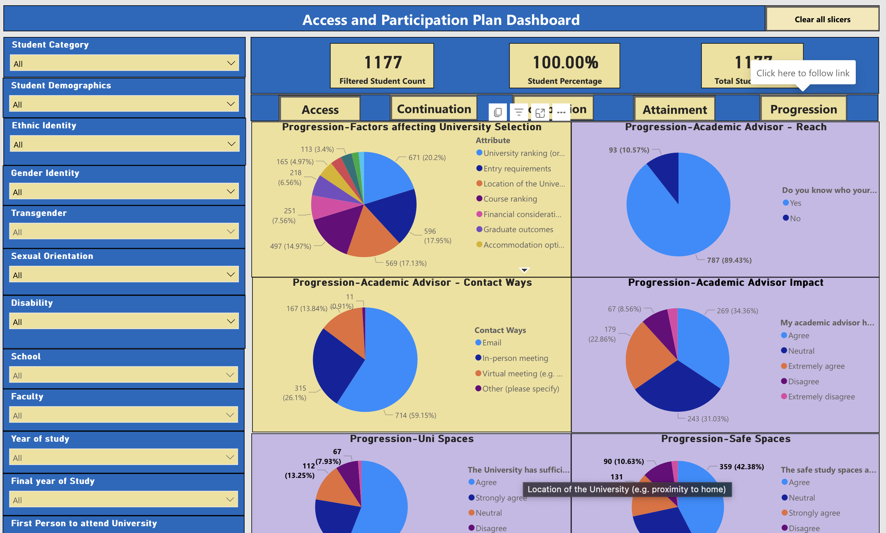

# 💻 Access and Participation Plan dashboard

The Access and Participation Plan (APP) dashboard serves as a comprehensive tool for tracking and promoting student access, success, and progression metrics, particularly focusing on underprivileged student groups. As a Student Data Analyst, my role in developing this dashboard was pivotal in harnessing data-driven insights to drive impactful educational equity strategies throughout the institution.

This dashboard is a vital tool for educators and administrators aiming to enhance educational equity and improve student outcomes by leveraging data-driven strategies.

The dashboard covers five key components:

## Access

The "Access" section of the dashboard provides critical insights into the factors influencing students' decisions and their initial engagement with higher education. It encompasses several key visualizations that highlight the primary sources of guidance and support for students, such as school or college staff, family members, friends, and current students, which are crucial in understanding the most influential support networks. This section also explores factors affecting university selection, such as university ranking, location, financial considerations, and course variety, which are essential for institutions to address student concerns and enhance their appeal.  Overall, the "Access" section is crucial for identifying and addressing the challenges students face during their initial engagement with higher education, offering actionable insights to improve access and support for all students, particularly those from underprivileged backgrounds.

## Continuation

The "Continuation" section of the dashboard focuses on monitoring the persistence of students in their studies and highlights the support systems and interventions that facilitate ongoing student engagement and retention. Key visualizations in this section include factors affecting university selection, where attributes such as university ranking, entry requirements, location, course ranking, financial considerations, graduate outcomes, and accommodation options are analyzed. Additionally, it evaluates the reach and impact of academic advisors, including whether students know their advisors, preferred contact methods (email, in-person, virtual meetings), and the perceived effectiveness of these advisors in supporting students.

## Completion

The "Completion" section of the dashboard provides insights into the factors that influence students' ability to successfully complete their courses. It examines the impact of course flexibility on completion rates, illustrating how various levels of flexibility (e.g., agreement or disagreement with course flexibility) affect student outcomes. Additionally, this section addresses financial aspects by analyzing the availability and accessibility of funds and bursaries, including attributes such as the Manchester Bursary, undergraduate access funds, and other financial support options. It also identifies barriers students face in accessing these financial resources, such as waiting times for funds, invasive requirements, and the overall process complexity. Overall, the "Completion" section is essential for understanding the various elements that contribute to student success, enabling institutions to address obstacles and provide targeted support to help students complete their education.

## Attainment

The "Attainment" section of the dashboard focuses on the academic achievements of students and the factors influencing their success. It includes visualizations on the impact of course flexibility, showing how different levels of agreement or disagreement with course flexibility correlate with attainment levels. Additionally, the teaching and learning experience is analyzed, with data on students' adjustment to academic life, helping to identify areas where additional support may be needed. Overall, the "Attainment" section is crucial for understanding the academic journey of students and identifying opportunities to enhance their educational experience and success.

## Progression

The "Progression" section of the dashboard examines the post-graduation outcomes of students and the factors influencing their career paths and further education opportunities. Key visualizations in this section include factors affecting university selection, where attributes such as university ranking, entry requirements, location, course ranking, financial considerations, graduate outcomes, and accommodation options are analyzed. This helps to understand what influences students' long-term educational and career decisions. The section also evaluates the role of academic advisors in students' progression, including the reach of advisors (whether students know their advisors), preferred contact methods (email, in-person, virtual meetings), and the perceived impact of advisors on students' career planning and further education. Additionally, it assesses the adequacy and availability of university spaces and safe study areas, providing insights into how the physical environment supports students' progression. 

Moreover, the dashboard facilitates communication with non-technical stakeholders by offering intuitive filters for sorting survey responses based on various demographic variables such as student category, demographic information, ethnic identity, gender identity, and more. This allows university administrators and Student Union members to gain nuanced insights into educational trends across different student demographics, informing targeted interventions and strategies. Overall, the Access and Participation Plan dashboard represents a powerful tool for driving positive change and fostering a culture of educational equity within the institution. By leveraging data to inform decision-making and engage stakeholders, the university can lead by example and inspire meaningful action towards a more inclusive and supportive educational environment.
